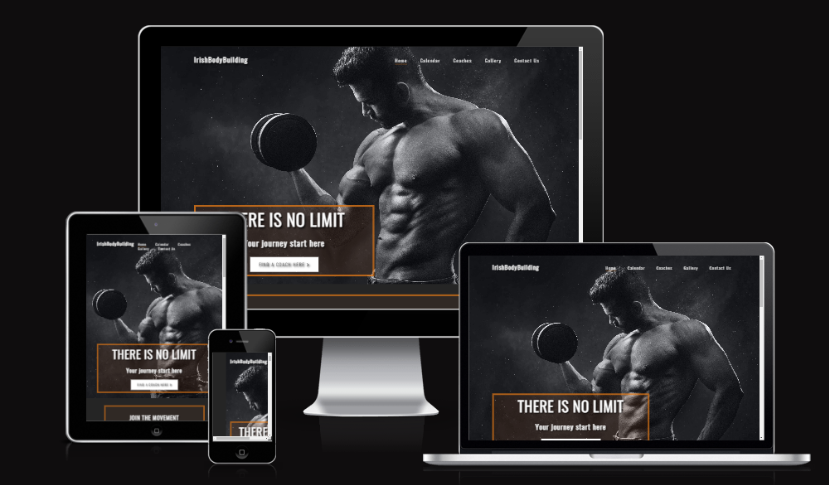
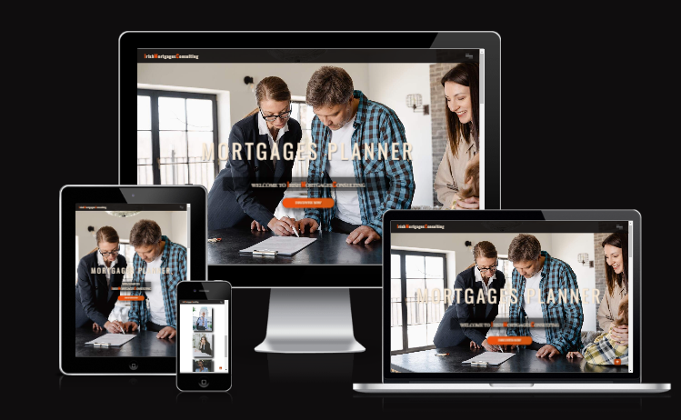

# GABRIELA DINU
## Full Stack Software with E-Commerce Applications and Code Institute Alumna
### About me 👋

## CONTACT ME

## MY TECH STACK

MY TECH STACK 💻 : 

**<>** **Programming Languages**

  
  
  
    
 

 
 📚 **Libraries &amp; Frameworks**
 

    
    
    
    
    
 

🗄️ **Databases**
  

    
        
 

 
💻 **Version Control, IDEs and Markdown**
 

     
     
     
     
    
   
 
 

🏦 **Hosting**

    
 

 
 ☁️ **Cloud Storage**
 

    
     
    
 
 
 
 ⚙️ **Wireframes, Interface Design &amp; Collaborative Whiteboard**
 

     
 
 

  🎨 **Adobe Creative Cloud**
 
 
    
 

---

## MILESTONE PROJECTS - Diploma in Web Application Development, Code Institute
*Level 6 Diploma in Web Application Development - Code Institute**
---

| Description | Languages & Technologies Used | Project Grade |
| :--- | :---: | :--- | 
| <u>Portfolio Project 1:</u>    [Irishbodybuilding](https://github.com/fitabigail/irishbodybuilding)         The Irishbodybuilding website is a landing page for new and experienced bodybuilder athletes looking for competitive performance. The Irishbodybuilding offers a guide for main bodybuilding organizations, trainers, and a competitional calendar.    **Features:**  1. CSS Flexbox and Grid    | HTML5, CSS | Pass  |   
| <u>Portfolio Project 2:</u>    [Irish Mortgage Consulting](https://github.com/fitabigail/IrishMortgageConsulting)       This project is the second one I've undertaken as part of the Full Stack Software Diploma course at Codeinstitute.net. It is a website about mortgages through brokers.    | HTML5, CSS, JavaScript | Pass |
| <u>Portfolio Project 3:</u>   [Family Quiz](https://github.com/fitabigail/family-quiz)       A family qiuz game complied a list of 10 questions, with answers of True or False.     **Features:**  1. Answer Validation   2. Live score counting    | Python and Javascript | Merit |
